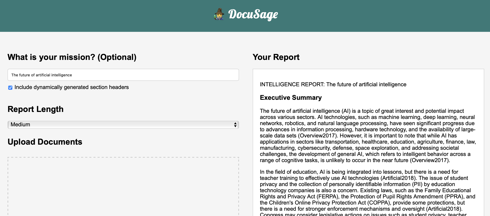

# 🧙‍♂️ DocuSage

Welcome to DocuSage - a fast, automated, and AI-fueled document analysis tool. Harnessing the power of advanced Large Language Models (LLMs), DocuSage is your platform to surf through mountains of data and pinpoint important information from your documents.

Imagine having an intelligent assistant, ready to dive into the haystack of information, pulling out not just the needle but the essential threads of value. That's DocuSage for you - your personal intelligence analyst, on call 24/7.

DocuSage accepts custom intelligence missions and capably handles multiple documents simultaneously, not only simplifying but enriching your document analysis tasks. It ensures you don't miss those crucial "needle-in-the-haystack" insights that can easily get lost in the sea of information.

DocuSage also features a user-friendly Web UI, making it even more accessible and easy to navigate through your document analysis tasks.

## Installation

To install DocuSage, you will first need to install Poetry, a tool for Python dependency management. You can install Poetry by following the instructions on the [official Poetry website](https://python-poetry.org/docs/).

Once you have installed Poetry, you can clone this repository and install the dependencies:

```bash
git clone https://github.com/tensorspace-ai/docusage.git
cd docusage
poetry install
```

## Usage

Example command line usage:

```bash
docusage ./doc1.txt ./doc2.txt --mission "Economy of Canada"
```

`docusage` is the command-line interface of DocuSage. Here's a breakdown of its switches and arguments:

### Positional Arguments

- **FILES**: These are the files you want the tool to analyze. You can specify multiple files for analysis. In the example, `./doc1.txt` and `./doc2.txt` are the two files being analyzed.

### Options

- **-h, --help**: Displays the help message for the command and exits.

- **--output OUTPUT, -o OUTPUT**: Allows you to specify an optional output file path where you want to save the analysis report.

- **--mission MISSION, -m MISSION**: This option lets you specify an optional mission prompt, such as "Economy of Canada". The prompt guides the analysis report created by DocuSage based on the documents.

- **--no-inline-references, -r**: Use this switch if you don't want references included in the report.

- **--no-inline-context, -c**: If set, the report won't include context excerpts from the source documents.

- **--length {tiny,small,medium,large,xlarge}, -n {tiny,small,medium,large,xlarge}**: Specifies the length of the generated report. Choose from one of the available sizes: tiny, small, medium, large, xlarge. If not specified, the default length of medium will be chosen.

- **--use-dynamic-sections, -d**: When this switch is used, the LLM dynamically generates section headers for the report. It provides a more structured and organized report layout based on the content being analyzed.

- **--llm LLM, -l LLM**: EXPERIMENTAL. Specifies which Large Language Model (LLM) you want to use for the analysis, registered on HuggingFace Hub. If not specified, the default LLMs (GPT3.5 and GPT4 for different tasks) from OpenAI will be used.

After you execute the command, DocuSage processes the provided files and displays the results. If you don't provide a mission using the `--mission` switch, DocuSage will carry out a general analysis of the documents and attempt to generate a title for it.

### Running built in web UI with Uvicorn



To start DocuSage using [Uvicorn](https://www.uvicorn.org), use the following command:

```bash
uvicorn docusage.web:app
```

By default, this will start the server on 127.0.0.1 (localhost) on port 8000. If you wish to change the host or port, use the --host and --port arguments like so:

```bash
uvicorn docusage.web:app --host 0.0.0.0 --port 8080
```

For a production environment, it's recommended to run Uvicorn behind an HTTP proxy server such as Nginx and to use a Uvicorn worker with Gunicorn. For example:

```bash
gunicorn docusage.web:app -w 4 -k uvicorn.workers.UvicornWorker
```

### OpenAI API Key Requirement

By default to use DocuSage, you need to have an account with OpenAI and an associated API key. The API key is used to interact with OpenAI's models, which are at the core of DocuSage's document analysis capabilities.

Here are the steps you need to follow to set up the OpenAI API key:

1. Create an account on the [OpenAI website](https://platform.openai.com/signup/).

2. After logging into your account, go to the API section. Here, you will find your API key. 

3. Set your OpenAI API key as an environment variable named `OPENAI_API_KEY` in your system.

    On Unix-based systems (like Linux or macOS), you can add the following line to your shell profile file (like `.bashrc`, `.bash_profile`, or `.zshrc`):

    ```bash
    export OPENAI_API_KEY="your-api-key"
    ```

    On Windows, you can set environment variables in the System Properties.

Remember to replace `"your-api-key"` with your actual OpenAI API key.

⚠️ **IMPORTANT:** Your OpenAI API key is sensitive information. Do not share it with others or expose it in public places like GitHub repositories.

## License

DocuSage is licensed under the terms of the Apache License.

## Contact

If you have any questions, feedback, or want to get involved in the DocuSage project, please feel free to reach out by opening an issue on our GitHub repository.